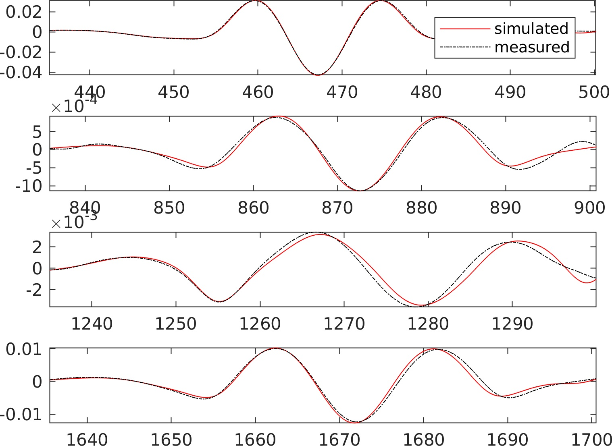

# Automated vehicle identification using bridge vibrations
Matlab algorithm to automatically identify key vehicle characteristics from vibrations data collected on a suspension bridge

## Summary

The present code implements in Matlab the procedure used in ref [1] to automatically identify key vehicle characteristics from vibrations data collected on a suspension bridge. Nevertheless, the present numerical implementation has some minor differences with ref [1]. The bridge is modelled using a continuum model to reduce the computational cost associated with the identification of the vehicles [2,3]. Vehicles are modelled as moving-masses to reduce the computational cost. In the following, only the vertical motion of the main span is modelled. This algorithm is suited to bridges in remote areas with little traffic.

 
## Content
The present submission contains:
  - A function eigenBridge.m that computes the modal parameters of a single-span suspension bridge.
  - A function filterMyData.m to extract the background component from the dynamic bridge response.
  - A function dynaResp_vehicle_TD.m that computes the bridge response to traffic loading (and wind loading, but this is not yet tested for wind + traffic).
  - A function findMass.m that aims to identify the mass fo the vehicles crossing the bridge.
  - A function findSpeed that aims to identify the sped fo the vehicles crossing the bridge.
  - A function findVehicleID.m that identify the number of vehicles crossing the bridge and their arrival time.
  - A function movingLoad.m that is used internally to compute the load of a moving mass on a beam.
  - A function RMSE.m that simply computes the root-mean-square error.
  - A Matlab livescript Example1.mlx 
  
## References
[1] Cheynet, E., Daniotti, N., Jakobsen,  J. B., & Snæbjörnsson, J. (2020). Improved long‐span bridge modeling using data‐driven identification of vehicle‐induced vibrations. Structural Control and Health Monitoring, volume 27, issue 9.  https://doi.org/10.1002/stc.2574

[2]  https://se.mathworks.com/matlabcentral/fileexchange/51815-calculation-of-the-modal-parameters-of-a-suspension-bridge

[3]  E.  Cheynet. ECheynet/EigenBridge v3.3. Zenodo, 2020,  https://doi.org/10.5281/ZENODO.3817982.

## Examples

###  Clustering and outlier analysis

### identification of the vehicle speed and arrival time

### Fitted and "measured" background bridge response

### Fitted and "measured" dynamic bridge response

